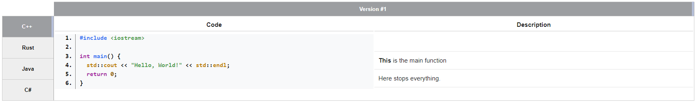

# MultiCodeBlock
Creates a codeblock consisting of multiple languages and a special way of commenting the code.



## How it works

The input is structured in a HTML-Style:
* `<multicodeblock>` - This is the main body of the codeblock and directly calls `MultiCodeBlock::renderMultiCodeBlock` by MediaWiki
    * `<codeblock lang="<language>">"` - These are the different codeblocks (languages). The order of these codeblocks decides the order in the navigation. The `language` is the filetype and not the name of the programming language itself, but it is possible to use the name.
        * `<code>` - This is the code itself and is going to be highlighted. (There can be multiple code blocks)
        * `<desc>` - The description is a block of different blocks of the description. (There can be multiple `desc`-Tags)
            * `<position line="<line-number>">` - The positions are holding the description itself the the starting point of the description (relative to the code). It is possible to write in Wiki-Syntax in these.

So it would be something like this:
```html
<multicodeblock>
    <codeblock lang="cpp">
        <code>
#include <iostream>
 
int main() {
  std::cout << "Hello, World!" << std::endl;

  return 0;
}
        </code>
        <desc>
            <position line="3">
                '''This''' is the <code>main</code>-function
            </position>
            <position line="5">
                Here stops everything.
            </position>
        </desc>
</multicodeblock>
```

Currently the tabs in the code are rendered in the browser and so there shouldn't be and unnecessary tabs. This creates the break in the `<code>`-block.

----

This codeblock is an element where the different versions of the code are accessible through a navigation on the left side.
The codeblocks itself are a table that has the code on the left side and the comments on the right side. The Code is seperated into rows with a simple ordered list that starts on each table cell with a specific value.

To avoid problems with selecting the code there are two ways of copying it: The first way is the raw selection that is made possible with JavaScript and the constant removal and addition of the `user-select: none;` css property and the second way is by clicking the button on the right side that is copying the code and is directly adding it into the clipboard.

## License
The project is licensed under the permissive Apache 2.0 License.